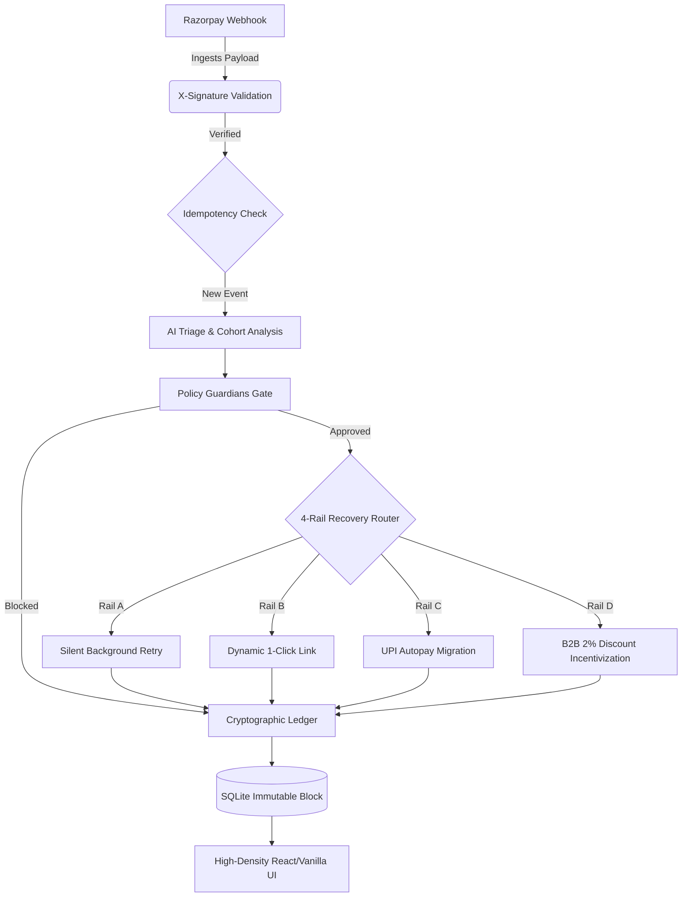

# PulseRecover Pro // Track 03: AI Revenue Recovery


PulseRecover Pro is a production-grade, AI-driven FinTech backend designed to autonomously recover failed transactions, combat cart abandonment, and rescue degrading mandates without violating stringent telecommunication and financial compliance regulations.

Built for the **Razorpay AI Buildathon (Track 03)**, this engine acts as a 4-Rail State Machine powered by real-time telemetry, embedded policy guardians, and an immutable SHA-256 cryptographic audit ledger.

---

## ⚡ System Architecture



---

## 🛤️ The 4-Rail Autonomous Recovery Matrix

| Cohort Name | Trigger Error Codes | AI Recovery Action Taken |
| :--- | :--- | :--- |
| **Rail A: Technical Downtime** | `503`, `GATEWAY_TIMEOUT`, `BANK_ERROR` | Suppresses user notifications; quietly queues the event for a background retry to avoid panic. |
| **Rail B: Consumer Drop-Off** | `ABORTED`, `USER_CLOSED_WINDOW` | Generates a dynamic 1-click Razorpay payment link with localized Hinglish copy. |
| **Rail C: Mandate Degradation** | `MANDATE_DEGRADED`, `CARD_EXPIRED` | Migrates the user seamlessly to a UPI Autopay plan, verifying the 24h pre-debit notice window. |
| **Rail D: B2B Overdue** | `INVOICE_OVERDUE` | Creates an immediate payment link with a 2% early-settlement incentive, while pausing outreach if a Promise-To-Pay (PTP) date exists. |

---

## 🛡️ Security & Compliance Guarantees

PulseRecover isn't just about recovering revenue; it's about recovering it legally and safely.

- **Cryptographic Audit Ledger**: Every recovery action is chained using `SHA-256` hashing (linking `prev_hash` to `current_hash`). The UI actively verifies this chain to detect any manual database tampering.
- **TRAI Quiet Hours Check**: Blocks SMS/WhatsApp dispatches between 9:00 PM and 9:00 AM IST to strictly comply with Indian telecommunication anti-harassment laws.
- **RBI 24-Hour Mandate Notice**: Aborts automated recovery attempts for recurring debits if a pre-debit notification was not successfully sent 24 hours prior.
- **₹15,000 High-Value Approval Gate**: Immediately pauses completely autonomous actions for high-value transactions (>₹15k), escalating them to a human operations manager.
- **2-Touch Harassment Cap**: Automatically limits the total number of automated outreaches to a single customer, preventing spam.

---

## 🚀 Setup & Local Execution

### 1. Environment Setup
```bash
# Clone the repository
git clone https://github.com/yourusername/PulseRecover-Pro.git
cd PulseRecover-Pro

# Create virtual environment and install dependencies
python -m venv venv
.\venv\Scripts\activate  # On Windows
pip install -r requirements.txt
```

### 2. Configure Variables
Rename `.env.example` to `.env` and add your Razorpay keys:
```env
RAZORPAY_KEY_ID=rzp_test_YOUR_KEY
RAZORPAY_KEY_SECRET=YOUR_SECRET
RAZORPAY_WEBHOOK_SECRET=your_webhook_secret
```

### 3. Run the API & Dashboard
```bash
python -m uvicorn app.main:app --reload
```
Navigate to: **`http://127.0.0.1:8000/dashboard`** to view the enterprise observability UI.

---

## 🧪 Testing & Live Simulation

### Run the Pytest Suite
We've included an extensive test suite validating the entire state machine and HMAC signatures.
```bash
pytest tests/ -v
```

### Run the 50-Scenario Benchmark Streamer
To see the system operate under pressure and watch the dashboard light up in real-time, keep the Uvicorn server running and in a second terminal execute:
```bash
python simulate_batch.py
```
This script injects 50 realistic failure events at `0.08s` intervals directly into the recovery pipeline.

---

## 📚 Core API Documentation

### `POST /webhooks/razorpay`
The primary ingestion point for live Razorpay failures.
- **Headers**: Requires valid `X-Razorpay-Signature`.
- **Payload**: Standard Razorpay `payment.failed` or `invoice.overdue` JSON.

### `POST /api/simulate`
An unprotected UI endpoint designed strictly for the interactive Sandbox Sandbox.
- **Payload**:
  ```json
  {
    "event_id": "sim_123",
    "error_code": "503",
    "error_description": "Bank Down",
    "amount_inr": 1500.0,
    "customer_phone": "9999999999"
  }
  ```

### `GET /api/metrics`
Feeds the dashboard its telemetry. Returns real-time breakdown of GMV recovered, live hash block strings, and boolean verification of the cryptographic chain.
